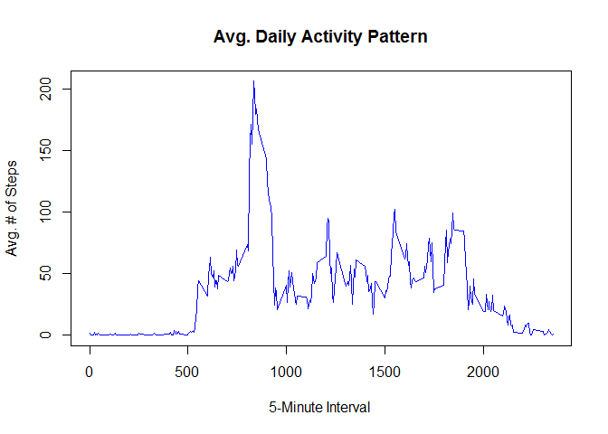
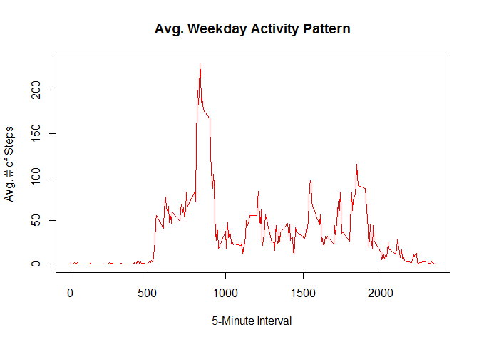

# Reproducible Research: Peer Assessment 1
***

## Data
####*Dataset:* 
* activity.csv (17,568 obs)

####*Variables:*
* steps: Number of steps taking in a 5-minute interval (missing values are coded as NA)
* date: The date on which the measurement was taken in YYYY-MM-DD format
* interval: Identifier for the 5-minute interval in which measurement was taken

***

## Loading and preprocessing the data
####*Load the data (i.e. read.csv())*

```r
     data <- read.csv("activity.csv")
```
####*Process/transform the data (if necessary) into a format suitable for your analysis.*

```r
     allsteps <- aggregate(steps~date, data=data, sum, na.rm=T)
```

***

## What is mean total number of steps taken per day?
####*Make a histogram of the total number of steps taken each day.*

```r
     library(ggplot2)
     qplot(steps, 
           data = allsteps, 
           geom = "histogram", 
           xlab = "Steps", 
           ylab = "Frequency",
           main = "Average # of Steps per Day",
           binwidth = 500, 
           col = I("black"),
           fill = I("blue")
           )
```


####*Calculate and report the mean and median of the total number of steps taken per day.*

```r
     meanstep <- format(mean(allsteps$steps), scientific = F)
     medianstep <- median(allsteps$steps)
```
* The mean total number of steps per day:
     + __10766.19__ steps.
* The median total number of steps per day:
     + __10765__ steps.

***

## What is the average daily activity pattern?
####*Make a time series plot of the 5-minute interval (x-axis) & the average number of steps taken, averaged across all days (y-axis).*

```r
     interval <- aggregate(steps~interval, data=data, mean, na.rm=T)
     plot(steps~interval,
          data = interval,
          type = "l",
          xlab = "5-Minute Interval ", 
          ylab = "Avg. # of Steps",
          main = "Avg. Daily Activity Pattern",
          col = "blue"
          )
```



####*Which 5-minute interval, on average across all the days in the dataset, contains the maximum number of steps?*

```r
     maxint <- interval$interval[which.max(interval$steps)]
```
* The interval with the highest average # of steps is __835__.
     
***

## Imputing missing values
####*Calculate and report the total number of missing values in the dataset.*

```r
     nacount <- sum(is.na(data$steps))
```
* There are a total of __2304__ rows with missing data.

####*Fill in missing values in the dataset (using 5-minute interval). Create new dataset without missing data.*

```r
     nafill <- data
     nafill$steps[is.na(nafill$steps)] <- tapply(nafill$steps, nafill$interval, mean, na.rm=T)
```

####*Make a histogram of the total # of steps taken each day.*

```r
     nonasteps <- aggregate(steps~date, data=nafill, sum)
     qplot(steps, 
           data = nonasteps, 
           geom = "histogram", 
           xlab = "Steps", 
           ylab = "Frequency",
           main = "Average # of Steps per Day",
           binwidth = 500, 
           col = I("black"),
           fill = I("blue")
           )
```


####*Calculate total mean & median # of steps per day.*

```r
     nonameanstep <- format(mean(nonasteps$steps), scientific = F)
     nonamedianstep <- format(median(nonasteps$steps), scientific = F)
```
* The mean total number of steps per day (with NAs filled in):
     + __10766.19__ steps.
* The median total number of steps per day (with NAs filled in):
     + __10766.19__ steps.

####*Do these values differ from earlier estimates? What is the impact of imputing missing data?*
* There is a minimal difference shown within the median by imputing missing data.

***

## Are there differences in activity patterns between weekdays and weekends?
####*Create new variable in dataset with two levels – “weekday” and “weekend”.*

```r
     #add day variable to dataset & define weekday vs. weekday
     nafill$day <- weekdays(as.Date(as.character(nafill$date)))  
     
     nafill$grp <- as.factor(c("Weekend","Weekday"))
     weekendvar <- nafill$day == "Saturday" | nafill$day == "Sunday"
     
     nafill$grp[!weekendvar] = "Weekday"    
     nafill$grp[weekendvar] = "Weekend"

     weekday <- nafill[nafill$grp == "Weekday",]
     weekend <- nafill[nafill$grp == "Weekend",]

     stepdays <- aggregate(steps~interval, weekday, mean)
     stepends <- aggregate(steps~interval, weekend, mean)

     plot(stepdays, 
          type = "l", 
          col = "red", 
          xlab = "5-Minute Interval ", 
          ylab = "Avg. # of Steps",
          main = "Avg. Weekday Activity Pattern"
          )
```



```r
     plot(stepends, 
          type = "l", 
          col = "blue", 
          xlab = "5-Minute Interval ", 
          ylab = "Avg. # of Steps",
          main = "Avg. Weekend Activity Pattern"
          )
```


